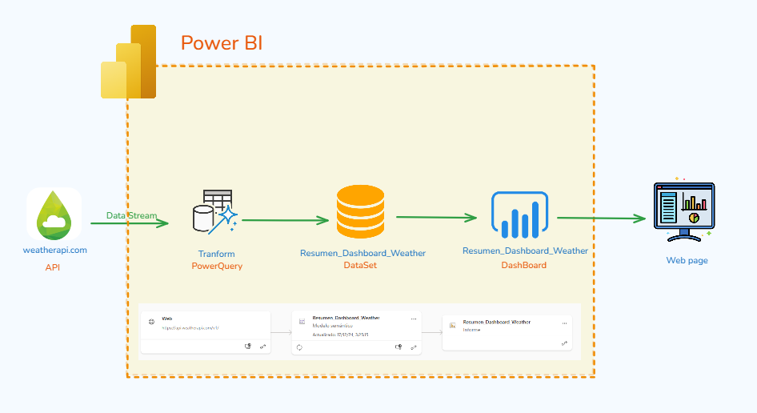
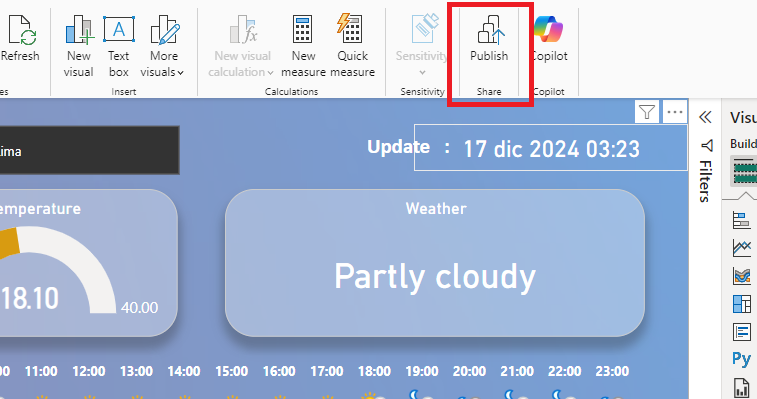
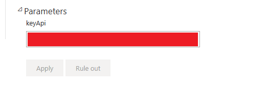
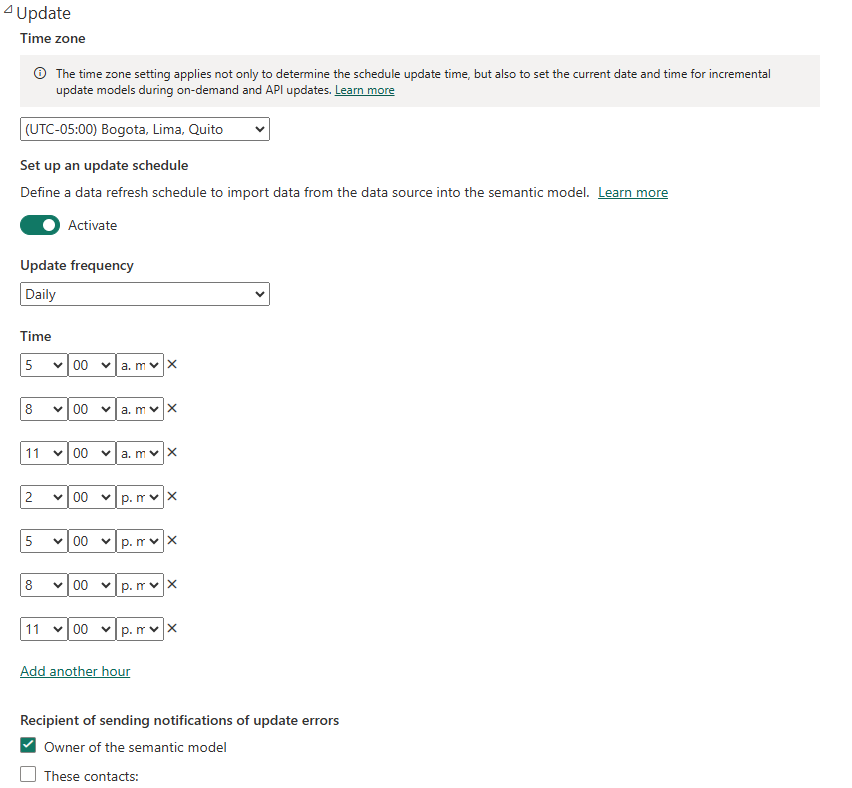
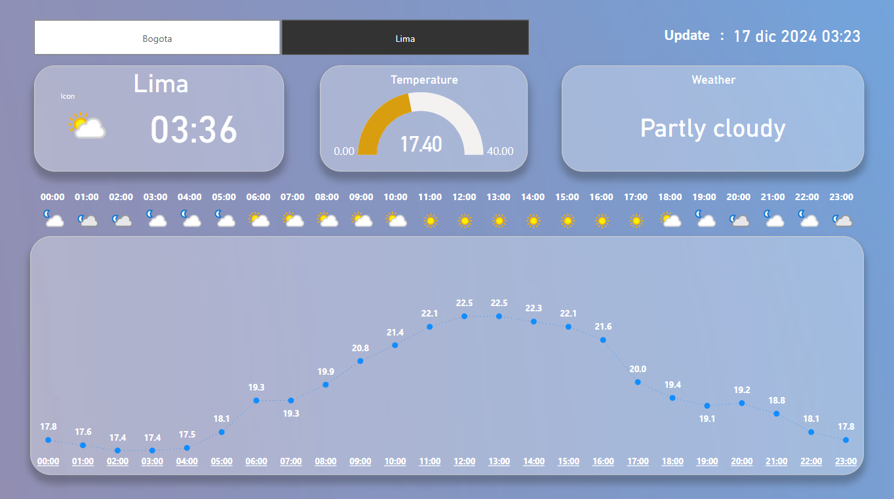

# Power BI - Using Web Contents, Parameters and Schedule Update

We will use a power bi pro account, to consume a REST api and publish it to a personal website with scheduled updates and parameters.



## Create Account API and deploy Dashboard

### Step 01 -  Create account Api Weather:

Example :

Creating account in :

https://www.weatherapi.com/

use the key that the website will give you, this key will be used in Power Query in Advance Editor:

``` powerShell
CurrentDate = DateTime.LocalNow(),
    FormattedDate = Date.ToText(DateTime.Date(CurrentDate), "yyyy-MM-dd"),

    Origen = 
    Json.Document(
        Web.Contents(
            "https://api.weatherapi.com/v1/",
            [RelativePath ="history.json?q=Lima&dt="& FormattedDate & "&end_dt=" & FormattedDate & "&key=" & keyApi ]
        )
    ),
    Origen_2= 
    Json.Document(
        Web.Contents(
            "https://api.weatherapi.com/v1/",
            [RelativePath ="history.json?q=Bogota&dt="& FormattedDate & "&end_dt=" & FormattedDate & "&key=" & keyApi ]
        )
    ),
``` 

### Step 02 - Publish Dashboard

Públish in workspace




### Step 03 - Using Key

Insert Value key in Parameter




### Step 04 - Program Update

We schedule updates every 3 hours




